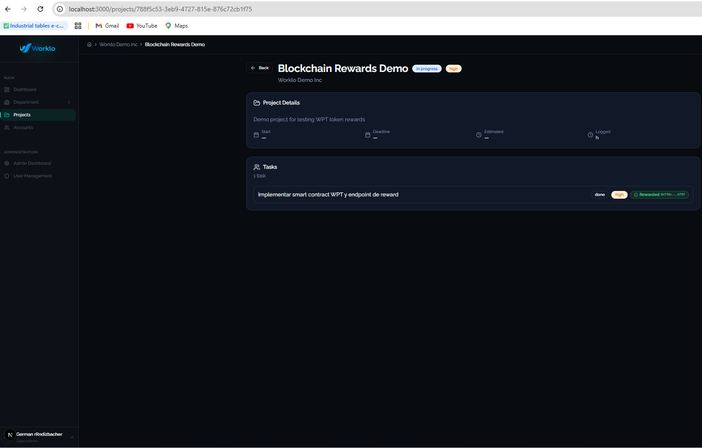

# Worklo Blockchain Assignment — Germán Rindizbacher

ERC-20 reward system for completed tasks in Worklo, running on a local Hardhat node. Full end-to-end flow: smart contract → API route → UI with loading/success/error states.

---

## ✅ Status: end-to-end working

Submitted an initial version with the contract, API route, and clean documentation. **Came back to the repo after the deadline to finish the frontend wiring** (Reward button with loading/success/error states), now complete and tested locally.



---

## 🚀 How to run

### Prereqs
- Node.js 18+
- A free Supabase project

### 1. Install dependencies
```bash
npm install
```

### 2. Configure environment variables
```bash
cp .env.local.template .env.local
```

Fill in `.env.local`:

```dotenv
# Supabase
NEXT_PUBLIC_SUPABASE_URL=https://<your-project>.supabase.co
NEXT_PUBLIC_SUPABASE_PUBLISHABLE_DEFAULT_KEY=<your-anon-key>
SUPABASE_SERVICE_ROLE_KEY=<your-service-role-key>

# Setup wizard (first-run only)
SETUP_SECRET=<generate-with-node--e-require_crypto_randomBytes_32_toString_hex>

# Blockchain (Hardhat local defaults)
HARDHAT_RPC_URL=http://127.0.0.1:8545
OWNER_PRIVATE_KEY=0xac0974bec39a17e36ba4a6b4d238ff944bacb478cbed5efcae784d7bf4f2ff80
WPT_CONTRACT_ADDRESS=0x5FbDB2315678afecb367f032d93F642f64180aa3
REWARD_RECIPIENT_ADDRESS=0x70997970C51812dc3A010C7d01b50e0d17dc79C8

# Demo mode off so the real email/password login is used
NEXT_PUBLIC_DEMO_MODE=false
```

### 3. Load the Supabase schema
Supabase Dashboard → SQL Editor → paste and run:
- `supabase/schema.sql`
- `supabase/seed-roles.sql`
- Then: `ALTER TABLE tasks ADD COLUMN IF NOT EXISTS tx_hash TEXT;`

### 4. Start the Hardhat node (terminal 1)
```bash
npx hardhat node
```
Keep it running.

### 5. Deploy the contract (terminal 2, once)
```bash
npx hardhat run scripts/deploy.js --network localhost
```
Confirm the address matches `WPT_CONTRACT_ADDRESS`.

### 6. Start Next.js (terminal 3)
```bash
npm run dev
```

### 7. First-time setup
- Open `http://localhost:3000` → onboarding wizard
- Get the setup token by calling `GET /api/onboarding/setup-token` (token is logged to the dev console; also stored in `setup_tokens` table)
- Complete the wizard to create your superadmin
- Log in with the email/password you set

### 8. Try the reward flow
- Create an account, a project, and a task with `status = 'done'` (via UI or SQL)
- Open the project detail page
- Click **"Reward WPT"** next to the completed task
- Watch the Hardhat node terminal: `WorkloToken#mint` is called, tx mined
- The button transitions to a green **"Rewarded 0x738c…679f"** badge
- The `tx_hash` is persisted in `tasks.tx_hash`

---

## ✅ What's implemented

### 1. Smart contract (`contracts/WorkloToken.sol`)
Minimal ERC-20 using OpenZeppelin v5:
- Inherits `ERC20` and `Ownable`
- Name: "Worklo Platform Token", symbol: "WPT"
- `mint(address to, uint256 amount)` restricted by `onlyOwner`
- Solidity ^0.8.20

### 2. Deploy script (`scripts/deploy.js`)
Deploys to the local Hardhat node using ethers v6 and prints the contract address.

### 3. API route (`app/api/tasks/[taskId]/reward/route.js`)
`POST /api/tasks/[taskId]/reward` — follows the existing pattern of `app/api/roles/route.js`:

- CommonJS exports (matches the rest of the codebase)
- Auth via `requireAuthAndPermission(Permission.MANAGE_TASKS, {}, request)`
- Structured logging via `logger`, `apiCall`, `apiResponse`, `databaseQuery`
- Error handling via `handleGuardError` (consistent with other routes)
- Dual Supabase clients: `createApiSupabaseClient` for reads (RLS respected), `createAdminSupabaseClient` for the `tx_hash` write (bypasses RLS as the system actor)

Flow:
1. Auth + permission check
2. Async `params` (Next.js 15 breaking change)
3. Fetch task by id and validate `status ∈ {done, completed}`
4. Idempotency: refuse if `tx_hash` already set
5. ethers v6 setup with `JsonRpcProvider` + `Wallet(OWNER_KEY)` + minimal ABI (`mint`, `decimals`)
6. `mint(REWARD_RECIPIENT, 10 * 10^decimals)` and wait for receipt
7. Persist `tx_hash` via the admin client
8. Return `{ txHash }`

Specific catch for `ECONNREFUSED`/`NETWORK_ERROR` returns `503` with the actionable message "Hardhat node not reachable", so the user sees a real explanation instead of a generic 500.

### 4. UI: `RewardButton` (`components/reward-button.tsx`)
Standalone, reusable component. Renders next to every task with `status === 'done'` in the project detail page.

Three states (matching the assignment requirements):
- **idle**: amber button "Reward WPT" with coin icon
- **loading**: same button disabled with spinner + "Minting…"
- **success**: green badge "Rewarded 0xabcd…1234" (truncated tx hash, monospaced)
- **error**: red "Retry" button with the actual error in the tooltip

On mount, the component checks `initialTxHash`. If the task already has a hash in Supabase, it starts directly in success state — so the badge survives page reloads.

Defensive fetch handling: `res.json().catch(() => ({ error: 'Invalid JSON response' }))` and `if (!res.ok) throw new Error(data.error || HTTP ${res.status})` — no more cryptic `Unexpected token '<', "<!DOCTYPE..."` errors when the backend returns HTML.

### 5. Misc fixes made along the way
- `app/login/page.tsx`: when `NEXT_PUBLIC_DEMO_MODE=false`, render a real email/password form instead of the seeded-user role picker. Lets you log in with the superadmin created in the onboarding wizard.
- `components/email-password-login.tsx`: new login form, reuses the existing `signInWithEmail` from `lib/auth.ts`.
- `lib/animation-variants.ts`: a couple of dashboard widgets imported `fadeInUp` / `staggerContainer` / `listItemFadeUp` from a file that didn't exist in the repo. Added minimal Framer Motion variants so the dashboard renders without build errors.

---

## 🔮 What I'd improve with more time

1. **Per-task reward amount**: hardcoded 10 WPT today. Add `tasks.reward_amount` (default 10) so different tasks can be worth different amounts — fits the PSA model where tasks have different weight.

2. **Per-user recipient resolution**: the recipient is a fixed env address today. In a real system each user would have a `user_profiles.wallet_address`; the route would mint to the wallet of the task's `assigned_to`, with the env address as a fallback.

3. **Stronger idempotency**: today the route does `SELECT tx_hash → if null → mint → UPDATE`. There's a small race window between the SELECT and the UPDATE. I'd close it with an atomic claim: `UPDATE tasks SET tx_hash = 'pending' WHERE id = $id AND tx_hash IS NULL RETURNING *`, then mint, then write the real hash; revert the claim on failure. For a production-grade version, a separate `reward_transactions` table with `(pending | confirmed | failed)` states and confirmations.

4. **Tests**: contract tests with Hardhat (owner can mint, non-owner reverts, totalSupply increases), plus an integration test for the route against an ephemeral Hardhat instance.

5. **Observability**: log `receipt.blockNumber`, `receipt.gasUsed`, `receipt.effectiveGasPrice` for auditing and cost tracking. Critical for real-network deployments.

6. **Key management**: `OWNER_PRIVATE_KEY` in `.env.local` is fine for local Hardhat. In production it should live in a KMS (AWS KMS, GCP Secret Manager) or a remote signer like OpenZeppelin Defender Relay or Fireblocks — never as a server env var.

7. **Block explorer link**: the badge currently truncates the hash. I'd make it a link to a block explorer when running against a real network (and to a local node UI if anything like that is available for Hardhat).

---

## 🛠️ Stack

- **Smart contract**: Solidity ^0.8.20, OpenZeppelin v5
- **Blockchain**: Hardhat 2.x local node
- **Backend**: Next.js 15 App Router, ethers v6
- **DB**: Supabase (Postgres + Auth)
- **Auth**: existing codebase pattern (`requireAuthAndPermission`)
- **Logging**: existing codebase logger (`@/lib/debug-logger`)

---

**Author**: Germán Rindizbacher  
**Contact**: grindiz1989@gmail.com · GitHub: [gerindiz](https://github.com/gerindiz)